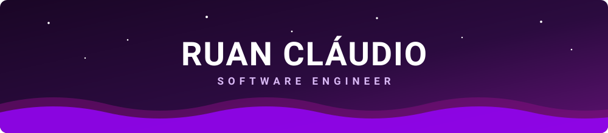
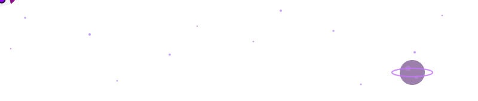
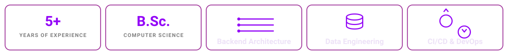

<div align="center">




[](https://www.linkedin.com/in/-ruanclaudio-/)
[](mailto:devruanclaudioofc@gmail.com)
[](https://github.com/ruanclaudio)

</div>

---

### 👋 About me

```python
class RuanClaudio(SoftwareEngineer):
    """Backend-heavy full-stack engineer. Scalable systems and AI integrations."""

    def __init__(self):
        self.role = "Software Engineer II, Full-Stack"
        self.experience = "5+ years"
        self.education = "B.Sc. Computer Science, UNIFACS"
        self.languages = ["Portuguese (native)", "English (B2)", "Spanish (A2)"]

        self.backend = ["Python", "FastAPI", "Django", "Flask", "SQLAlchemy", "Java"]
        self.frontend = ["React", "React Native", "TypeScript", "Bootstrap"]
        self.data = ["PostgreSQL", "MySQL", "MongoDB", "Redis", "SQLite"]
        self.infra = ["Docker", "Nginx", "Gunicorn", "GCP", "CI/CD", "Grafana"]

        self.interests = ["Clean architecture", "Observability", "Astrophysics"]

    def current_focus(self) -> str:
        return "Multi-agent LLM workflows with guardrails that actually hold."

    def say_hi(self) -> None:
        print("Thanks for dropping by! Let's build something together.")
```

---

### 🛠️ Tech Stack

<div align="center">

**Backend & APIs**

[](https://skillicons.dev)

**Frontend & Mobile**

[](https://skillicons.dev)

**Databases**

[](https://skillicons.dev)

**Infrastructure & DevOps**

[](https://skillicons.dev)

</div>

---

### ✨ Highlights



---

### 📊 GitHub Streak

<div align="center">


</div>

---

### 🐍 Contribution Snake

<div align="center">
  
<picture>
  <source media="(prefers-color-scheme: dark)" srcset="https://raw.githubusercontent.com/ruanclaudio/ruanclaudio/output/github-snake-dark.svg" />
  <source media="(prefers-color-scheme: light)" srcset="https://raw.githubusercontent.com/ruanclaudio/ruanclaudio/output/github-snake.svg" />
  
</picture>

</div>

---

### 🚀 Featured Projects

| Project | Description | Stack |
| :--- | :--- | :--- |
| **IZap.ai** | AI-powered conversational platform for business-customer interactions over WhatsApp. Foundational engineer on the core architecture, focused on scalability and high-performance message processing. | `Python` `FastAPI` `SQLAlchemy` `PostgreSQL` `Docker` `Redis` `Grafana` |

---

<div align="center">

**Visitors Count**


</div>


